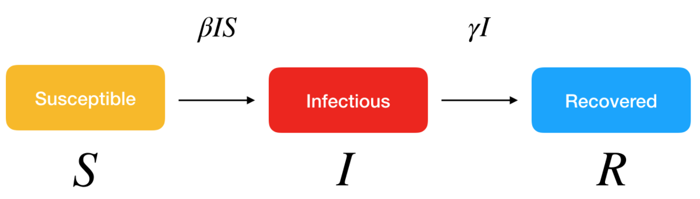
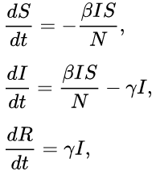
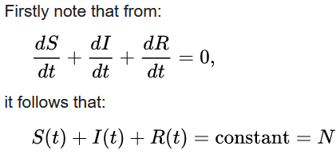
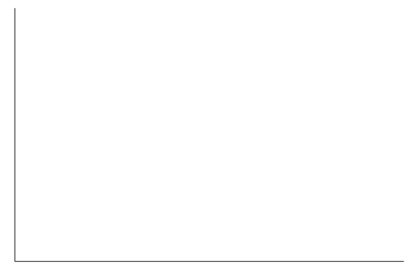
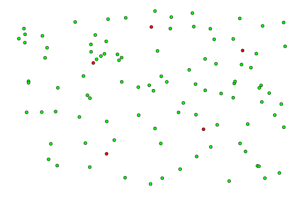
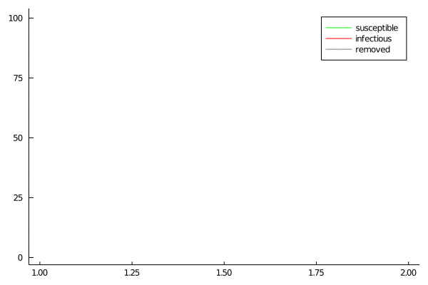

### The SIR model
The SIR model is a set of differential equations used to model epidemic spread. S is the number of people who are susceptible, I is the number of people who are infected and R is the number of people who are removed (removed = dead or recovered). We assume that nobody is getting in or out of the pandemic zone (a closed system).

### Simulation 
We can also simulate the epidemic. The SIR curves look very similiar to the the solution curves of the differential equations show above. Each blob is either susceptible (green), infected (red) or removed (gray). At each timestep, an infected blob can pass the disease to nearby susceptible blobs. We can adjust the infection rate, radius of infection, the population size, initial number of infected blobs and the size of the map. 

